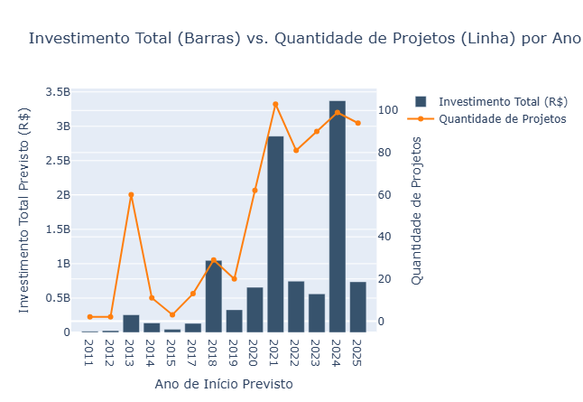
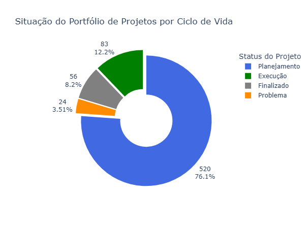
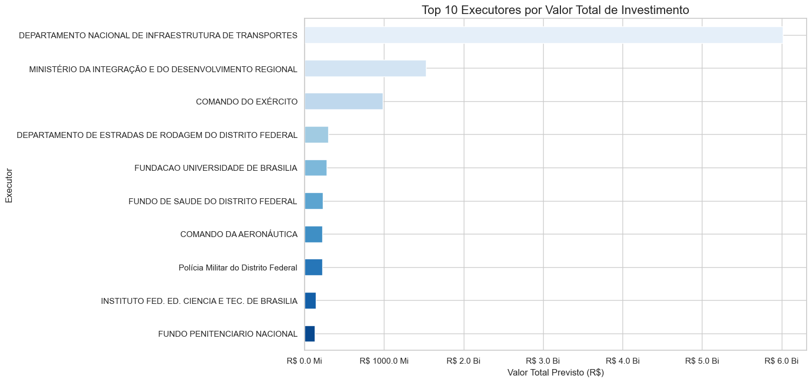
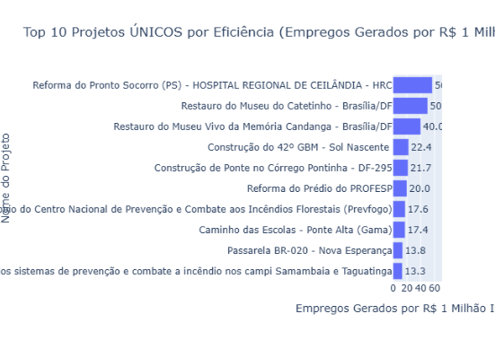

# 🏗️ Análise de Pipeline de Obras Públicas (ObrasGov - DF)

<p align="center">
  <a href="#📘-visão-geral">Visão Geral</a> •
  <a href="#📊-1-principais-insights-visuais">Principais Insights</a> •
  <a href="#⚙️-2-instalação-e-execução">Instalação e Execução</a> •
  <a href="#📂-3-estrutura-de-pastas">Estrutura de Pastas</a> •
  <a href="#🔍-4-o-pipeline-de-dados--análise-dos-notebooks">Pipeline de Dados</a> •
  <a href="#📝-conclusão">Conclusão</a> 
</p>

## 📘 Visão Geral

Este projeto é uma **análise de ponta a ponta (end-to-end)** do pipeline de dados de obras de infraestrutura no **Distrito Federal**, utilizando dados da **API pública ObrasGov**.

O objetivo é construir um **pipeline ETL completo**, desde a extração de dados brutos até um banco de dados relacional e, finalmente, a geração de um **dashboard de insights acionáveis**.

---

## 📊 1. Principais Insights Visuais

Nesses exmplos (mais nos notebooks) de visualizações foi revelado **padrões claros** sobre o portfólio de projetos no DF:

| Visualização | Insight Chave |
|:-------------:|:--------------|
|  | **Investimento por Projeto:** Este gráfico de eixo duplo expõe uma **desconexão** crucial entre o **volume de investimento** (barras) e a **quantidade de projetos** (linha).  |
|  | **Gargalo de Planejamento:** 76,1% do portfólio (520 projetos) está estagnado na fase de *Planejamento*, provando que o desafio não é falha, mas **inércia em iniciar os projetos**. |
|  | **Concentração de Capital:** O *Eixo Econômico* (Rodovias) domina o investimento, respondendo sozinho por **64,9% (R$ 2,0 Bilhão)** de todo o valor. |
|  | **Eficiência Social:** O maior retorno social (*empregos por milhão*) não está nos megaprojetos, mas em **obras sociais**, como *Construção de Unidade Básica de Saúde* (140+ empregos/milhão). |

---

## ⚙️ 2. Instalação e Execução

### Pré-requisitos
- Python **3.10+**  
- Docker Desktop
- Git  

---

### Instalação

#### 🔹 Clone o Repositório
```bash
git clone https://github.com/seu-usuario/seu-repositorio.git
cd seu-repositorio
```
#### 🔹 Crie o Ambiente Virtual e Instale as Dependências
```bash
# Crie o ambiente virtual
python -m venv venv

# Ative o ambiente (Linux/Mac)
source venv/bin/activate
# (No Windows)
venv\Scripts\activate

# Instale as bibliotecas
pip install -r requirements.txt
```
#### 🔹 Configure as Variáveis de Ambiente
Crie um arquivo chamado .env na raiz do projeto com suas credenciais:

```bash
PG_HOST=localhost
PG_PORT=5432
PG_DB=meu_banco
PG_USER=meu_usuario
PG_PASSWORD=minha_senha_secreta
```
> ⚠️ Este arquivo é ignorado pelo Git (.gitignore).

#### 🔹 Inicie o Banco de Dados (via Docker)
```bash
docker run --name meu-postgres \
  -e POSTGRES_PASSWORD=minha_senha_secreta \
  -e POSTGRES_USER=meu_usuario \
  -e POSTGRES_DB=meu_banco \
  -p 5432:5432 \
  -d postgres
```
### Execução

#### 🔹 Execute o Pipeline de Notebooks
É essencial executar os notebooks na **ordem correta**, pois eles dependem entre si.

```text
notebooks/
├── 01_data_extraction.ipynb
├── 02_data_transformation.ipynb
├── 03_data_load.ipynb
└── 04_data_analysis.ipynb
```
## 📂 3. Estrutura de Pastas
```text
.
├── notebooks/
│   ├── 01_data_extraction.ipynb     # (E) Extração de dados brutos da API
│   ├── 02_data_transformation.ipynb # (T) Limpeza, Normalização e Feature Engineering
│   ├── 03_data_load.ipynb           # (L) Carga dos dados limpos no PostgreSQL
│   └── 04_data_analysis.ipynb       # (Análise) Visualização e geração de insights
│
├── data/
│   ├── raw/                         # (Saída do Notebook 01)
│   │   └── dados_brutos.parquet
│   └── processed/                   # (Saída do Notebook 02)
│       └── dados_projetos_limpos.parquet
│
├── .env                             # (Configuração local - NÃO ENVIAR AO GIT)
├── .gitignore
├── requirements.txt
└── README.md
```

## 🔍 4. O Pipeline de Dados — Análise dos Notebooks
### 01_data_extraction.ipynb (Extração)
- **Função**: Conecta-se à API pública do ObrasGov, filtrando projetos pelo estado DF.

- **Processo**: API com limitações de extração e paginação de dados.

- **Saída**: dados_brutos.parquet salvo em data/raw/.

### 02_data_transformation.ipynb (Transformação)
- **Função**: O “T” do ETL — limpeza, normalização e enriquecimento.

- **Processos Principais**:

  - Remoção de duplicados com drop_duplicates(subset='id_unico').

  - Padronização de texto (.str.strip().str.upper()).

  - Criação de novas features ex.:

    -  valor_total_investimento

    -  empregos_por_milhao_brl

    - status_agrupado

    - faixa_valor

- **Saída**: DataFrames limpos e enriquecidos em data/processed/.

### 03_data_load.ipynb (Carga)
- **Função**: O “L” do ETL —> popula o banco de dados.

- **Processos**: Armazenamento de dados .paquet em .db

- **Saída**: Banco PostgreSQL relacional em container.

### 04_data_analysis.ipynb (Análise)
- **Função**: Conecta-se ao banco e gera as visualizações principais.

- **Processo**: Transformação de dados em **Insight**.

- **Resultado**: Geração dos gráficos que originaram os insights do início deste README.

## 📝 Conclusão
Este pipeline demonstra a importância de um fluxo de dados limpo, integrado e auditável, permitindo revelar gargalos estruturais e ineficiências financeiras em obras públicas do DF.

> Resultado final: uma base de dados confiável, visualizações significativas e uma visão clara sobre onde, e por que, o progresso para.

**Autor**: [Tiago Bittencourt](https://github.com/TiagoSBittencourt)  
**Fonte de dados**: [API ObrasGov.br](https://api.obrasgov.gestao.gov.br/obrasgov/api/swagger-ui/index.html)